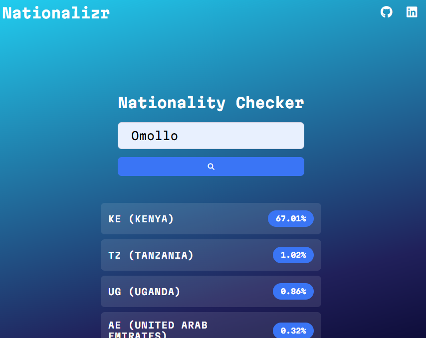

# 🌍 Nationalizr

A simple web application that predicts nationality based on names using real-time API integration.

## ✨ Features

- **Probability-based Results** - Shows likelihood percentages for each country
- **Clean UI/UX** - Modern gradient design with responsive layout
- **Error Handling** - User-friendly error messages and validation
- **Mobile Responsive** - Works seamlessly across all devices

## 🚀 Live Demo

[View Live Demo](https://nationalizr.vercel.app/) <!-- Add your live demo link here -->

## 🛠️ Technologies Used

- **HTML5** - Semantic markup structure
- **CSS3** - Custom styling with gradients and animations
- **Vanilla JavaScript** - API integration and DOM manipulation
- **Nationalize.io API** - Nationality prediction service
- **Font Awesome** - Icons for enhanced UI
- **Google Fonts** - Martian Mono typography

## 📱 Preview


## 🏃‍♂️ Getting Started

### Prerequisites

- Modern web browser
- Internet connection (for API calls)

### Installation

1. Clone the repository
```bash
git clone https://github.com/arman-develops/nationalizr.git
```

2. Navigate to project directory
```bash
cd nationalizr
```

3. Open `index.html` in your browser or serve with a local server
```bash
# Using Node.js
npm run dev
```

4. Visit `http://localhost:5173` in your browser

## 💻 Usage

1. Enter a name in the search field
2. Click the search button or press Enter
3. View nationality predictions with probability percentages
4. Results display the top 5 most likely countries

## 🔧 API Reference

This project uses the [Nationalize.io API](https://nationalize.io/):

```
GET https://api.nationalize.io/?name={name}
```

**Response Format:**
```json
{
  "count": 12345,
  "name": "example",
  "country": [
    {
      "country_id": "US",
      "probability": 0.123
    }
  ]
}
```

## 🎨 Customization

### Colors
Update CSS custom properties in `:root`:
```css
:root {
    --background-color: your-gradient-here;
    --secondary-background-color: your-color;
    --text-white: #fff;
}
```

### Fonts
Change the font family by updating the Google Fonts import and CSS:
```css
@import url('your-font-url');
--primary-font: "Your Font", monospace;
```
## 🙏 Acknowledgments

- [Nationalize.io](https://nationalize.io/) for providing the nationality prediction API
- [Font Awesome](https://fontawesome.com/) for the beautiful icons
- [Google Fonts](https://fonts.google.com/) for the Martian Mono typeface

## 📧 Contact

**Victor Amon** - [LinkedIn](https://linkedin.com/in/victor-amon) - [GitHub](https://github.com/arman-develops)

Project Link: [https://github.com/arman-develops/nationalizr](https://github.com/arman-develops/nationalizr)

---

⭐ Star this repo if you found it helpful!